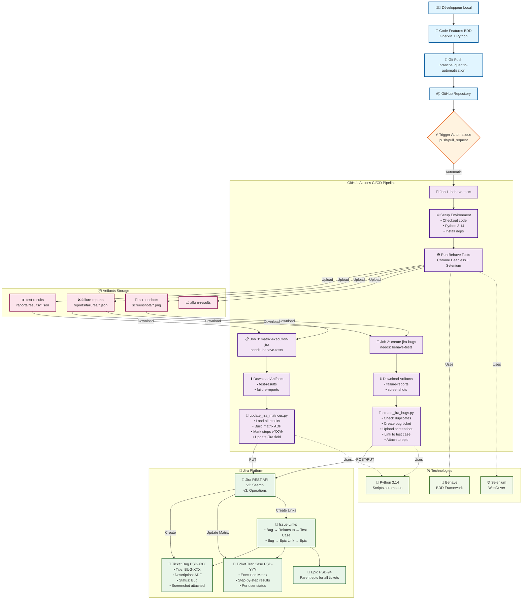

# 📋 Rapport d'Automatisation - Projet SauceDemo

**Auteur** : Quentin Plet  
**Projet** : Tests End-to-End automatisés avec Jira  
**Date** : Mars 2026  
**Application testée** : [SauceDemo](https://www.saucedemo.com)

---

## 📑 Table des matières

1. [Vue d'ensemble du projet](#1-vue-densemble-du-projet)
2. [Architecture globale](#2-architecture-globale)
3. [Stack technologique](#3-stack-technologique)
4. [Gestion de version avec Git](#4-gestion-de-version-avec-git)
5. [Framework de test : Behave + Selenium](#5-framework-de-test--behave--selenium)
6. [Pipeline CI/CD GitHub Actions](#6-pipeline-cicd-github-actions)
7. [Intégration Jira automatisée](#7-intégration-jira-automatisée)
8. [Cas d'usage significatif](#8-cas-dusage-significatif)
9. [Rapports générés](#9-rapports-générés)
10. [Résultats et métriques](#10-résultats-et-métriques)
11. [Points clés et défis techniques](#11-points-clés-et-défis-techniques)

---

## 1. Vue d'ensemble du projet

### 🎯 Objectifs

Ce projet vise à **automatiser intégralement** le cycle de test de l'application SauceDemo, de l'exécution des tests à la création de tickets Jira, en passant par la génération de rapports et la mise à jour de matrices d'exécution.

**Problématiques résolues** :

- ✅ Exécution automatique des tests sur chaque commit
- ✅ Création automatique de tickets de bug dans Jira avec screenshots
- ✅ Mise à jour de matrices d'exécution détaillées par utilisateur
- ✅ Traçabilité complète entre tests, bugs et cas de test
- ✅ Détection précise de l'étape échouée dans les scénarios

### 🔄 Workflow global

```
┌─────────────────┐
│  Git Push       │
│  (développeur)  │
└────────┬────────┘
         │
         ▼
┌─────────────────────────────────┐
│  GitHub Actions CI/CD            │
│  ┌────────────────────────────┐ │
│  │ 1. Checkout code           │ │
│  │ 2. Setup Python + deps     │ │
│  │ 3. Tests Behave + Selenium │ │
│  │ 4. Upload artifacts        │ │
│  └────────────────────────────┘ │
└────────┬────────────────────────┘
         │
         ├──────────────┬─────────────────┐
         ▼              ▼                 ▼
┌──────────────┐  ┌──────────────┐  ┌──────────────┐
│ Création     │  │ Mise à jour  │  │ Rapport      │
│ tickets Bug  │  │ matrices     │  │ Allure       │
│ dans Jira    │  │ d'exécution  │  │              │
└──────────────┘  └──────────────┘  └──────────────┘
```

---

## 2. Architecture globale

### 🏗️ Schéma d'architecture complet

```
┏━━━━━━━━━━━━━━━━━━━━━━━━━━━━━━━━━━━━━━━━━━━━━━━━━━━━━━━━━━━━━━━━━━━━━━━━━━━┓
┃                        PROJET AUTOMATISATION - SAUCEDEMO                    ┃
┗━━━━━━━━━━━━━━━━━━━━━━━━━━━━━━━━━━━━━━━━━━━━━━━━━━━━━━━━━━━━━━━━━━━━━━━━━━━┛

┌─────────────────────────────────────────────────────────────────────────────┐
│                             DÉVELOPPEUR                                     │
│                                                                             │
│  ┌──────────────┐    git push    ┌─────────────────────────────────────┐  │
│  │   Code       │ ─────────────► │      GitHub Repository              │  │
│  │   Local      │                │  (branche: quentin-automatisation)  │  │
│  └──────────────┘                └─────────────────────────────────────┘  │
└─────────────────────────────────────────────────────────────────────────────┘
                                            │
                                            │ Trigger automatique
                                            ▼
┏━━━━━━━━━━━━━━━━━━━━━━━━━━━━━━━━━━━━━━━━━━━━━━━━━━━━━━━━━━━━━━━━━━━━━━━━━━━┓
┃                         GITHUB ACTIONS CI/CD PIPELINE                       ┃
┗━━━━━━━━━━━━━━━━━━━━━━━━━━━━━━━━━━━━━━━━━━━━━━━━━━━━━━━━━━━━━━━━━━━━━━━━━━━┛

┌─────────────────────────────────────────────────────────────────────────────┐
│  JOB 1: behave-tests                                                        │
│  ┌────────────────────────────────────────────────────────────────────┐    │
│  │  1. Checkout code (actions/checkout@v4)                            │    │
│  │  2. Setup Python 3.14 (actions/setup-python@v5)                    │    │
│  │  3. Install dependencies (pip install -r requirements.txt)         │    │
│  │  4. Run Behave tests (Headless Chrome)                             │    │
│  │     └─► behave --format=allure_behave.formatter:AllureFormatter    │    │
│  │  5. Upload artifacts                                                │    │
│  │     ├─► test-results (reports/results/*.json)                      │    │
│  │     ├─► failure-reports (reports/failures/*.json)                  │    │
│  │     ├─► screenshots (screenshots/*.png)                            │    │
│  │     └─► allure-results                                             │    │
│  └────────────────────────────────────────────────────────────────────┘    │
└─────────────────────────────────────────────────────────────────────────────┘
                           │                        │
                           │                        │
          ┌────────────────┴────────┐      ┌────────┴───────────┐
          ▼                         ▼      ▼                    ▼
┌─────────────────────────┐   ┌──────────────────────────┐
│ JOB 2:                  │   │ JOB 3:                   │
│ create-jira-bugs        │   │ matrix-execution-jira    │
│ (needs: behave-tests)   │   │ (needs: behave-tests)    │
├─────────────────────────┤   ├──────────────────────────┤
│ 1. Download artifacts:  │   │ 1. Download artifacts:   │
│    • failure-reports    │   │    • test-results        │
│    • screenshots        │   │    • failure-reports     │
│                         │   │                          │
│ 2. Execute Python:      │   │ 2. Execute Python:       │
│    create_jira_bugs.py  │   │    update_jira_matrices  │
│                         │   │                          │
│ 3. Pour chaque échec:   │   │ 3. Pour chaque TC:       │
│    ├─ Vérifie doublon   │   │    ├─ Charge résultats   │
│    ├─ Crée ticket Bug   │   │    ├─ Construit matrice  │
│    ├─ Upload screenshot │   │    │   • ✅ avant échec   │
│    ├─ Lien test case    │   │    │   • ❌ étape échouée│
│    └─ Attache à epic    │   │    │   • ⊘ non exécuté   │
│                         │   │    └─ Update Jira        │
└────────┬────────────────┘   └────────┬─────────────────┘
         │                             │
         │                             │
         ▼                             ▼
┏━━━━━━━━━━━━━━━━━━━━━━━━━━━━━━━━━━━━━━━━━━━━━━━━━━━━━━━━━━━━━━━━━━━━━━━━━━━┓
┃                           JIRA (aqaformation.atlassian.net)                 ┃
┗━━━━━━━━━━━━━━━━━━━━━━━━━━━━━━━━━━━━━━━━━━━━━━━━━━━━━━━━━━━━━━━━━━━━━━━━━━━┛

┌─────────────────────────┐  ┌─────────────────────────┐  ┌──────────────────┐
│  TICKETS DE BUG (PSD-X) │  │ TICKETS TEST CASE       │  │ EPIC (PSD-94)    │
│  ┌────────────────────┐ │  │  (PSD-145, PSD-147...)  │  │                  │
│  │ Titre: [BUG] xxx   │ │  │  ┌────────────────────┐ │  │ Epic parent      │
│  │ Description: ADF   │ │  │  │ Matrice exécution  │ │  │ pour tous les    │
│  │ Screenshot: PNG    │ │  │  │ ┌────┬─────┬─────┐ │ │  │ tickets du       │
│  │ Statut: Bug        │ │  │  │ │Step│User1│User2│ │ │  │ projet           │
│  │                    │ │  │  │ ├────┼─────┼─────┤ │ │  │                  │
│  │ Liens:             │ │  │  │ │ 1  │ ✅  │ ✅  │ │ │  └──────────────────┘
│  │  • Relates to      │ │  │  │ │ 2  │ ✅  │ ❌  │ │ │         ▲
│  │    PSD-145 ────────┼─┼──┼──┼─│ 3  │ ✅  │ ⊘   │ │ │         │
│  │  • Epic: PSD-94 ───┼─┼──┼──┼─│ Final│PASS│FAIL │ │ │         │
│  │                    │ │  │  │ └────┴─────┴─────┘ │ │  ◄──────┴─────────┐
│  └────────────────────┘ │  │  └────────────────────┘ │                    │
│                         │  │                         │                    │
│  ┌────────────────────┐ │  │  Éléments associés:    │                    │
│  │ 📎 Attachments     │ │  │   • Bug: PSD-312       │                    │
│  │  • screenshot.png  │ │  │   • Bug: PSD-313       │                    │
│  └────────────────────┘ │  │   • Bug: PSD-314       │                    │
└─────────────────────────┘  └─────────────────────────┘                    │
         │                            │                                      │
         └────────────────────────────┴──────────────────────────────────────┘
                                      │
                        Toutes les relations sont créées
                        automatiquement par les scripts Python

┏━━━━━━━━━━━━━━━━━━━━━━━━━━━━━━━━━━━━━━━━━━━━━━━━━━━━━━━━━━━━━━━━━━━━━━━━━━━┓
┃                              COMPOSANTS TECHNIQUES                          ┃
┗━━━━━━━━━━━━━━━━━━━━━━━━━━━━━━━━━━━━━━━━━━━━━━━━━━━━━━━━━━━━━━━━━━━━━━━━━━━┛

┌──────────────────┐  ┌──────────────────┐  ┌──────────────────┐
│   BEHAVE         │  │   SELENIUM       │  │   JIRA API       │
│   ────────       │  │   ────────       │  │   ────────       │
│ • Gherkin DSL    │  │ • WebDriver      │  │ • REST v2/v3     │
│ • Scenario       │  │ • Chrome         │  │ • ADF format     │
│ • Steps          │  │ • Headless       │  │ • Issue Links    │
│ • Hooks          │  │ • Screenshots    │  │ • Attachments    │
│ • environment.py │  │ • Waits          │  │ • Custom fields  │
└──────────────────┘  └──────────────────┘  └──────────────────┘

┌──────────────────────────────────────────────────────────────────┐
│                    FORMATS DE DONNÉES                            │
│                                                                  │
│  JSON (rapports)    ADF (Jira)    PNG (screenshots)             │
│  ├─ results/        ├─ Paragraphes ├─ Headless capture         │
│  │  └─ status      ├─ Tables      └─ RFC 2231 encoding         │
│  └─ failures/      ├─ Headings                                  │
│     └─ failed_step └─ Lists                                     │
└──────────────────────────────────────────────────────────────────┘

┏━━━━━━━━━━━━━━━━━━━━━━━━━━━━━━━━━━━━━━━━━━━━━━━━━━━━━━━━━━━━━━━━━━━━━━━━━━━┓
┃                                  LÉGENDE                                    ┃
┣━━━━━━━━━━━━━━━━━━━━━━━━━━━━━━━━━━━━━━━━━━━━━━━━━━━━━━━━━━━━━━━━━━━━━━━━━━━┫
┃  ──► Flux de données                      ⊘ Étape non exécutée             ┃
┃  ├── Dépendance                           ✅ Étape réussie                  ┃
┃  └── Contient                             ❌ Étape échouée                  ┃
┗━━━━━━━━━━━━━━━━━━━━━━━━━━━━━━━━━━━━━━━━━━━━━━━━━━━━━━━━━━━━━━━━━━━━━━━━━━━┛
```

### � Diagramme Mermaid interactif



**Légende du diagramme** :

- 🟦 **Bleu** : Développement local et Git
- 🟧 **Orange** : CI/CD triggers et orchestration
- 🟪 **Violet** : Jobs et scripts d'exécution
- 🟩 **Vert** : Plateforme Jira et tickets
- 🟥 **Rose** : Artifacts et rapport
- 🟨 **Vert clair** : Technologies utilisées

### �📁 Structure du projet

```
projet-SwagLabs/
│
├── features/                          # Tests BDD Gherkin
│   ├── __init__.py                    # Package Python
│   ├── cart.feature                   # Tests panier
│   ├── catalogue.feature              # Tests catalogue
│   ├── checkout.feature               # Tests commande
│   ├── checkout2.feature              # Tests calculs avancés
│   ├── login.feature                  # Tests authentification
│   ├── tri.feature                    # Tests tri produits
│   ├── environment.py                 # Hooks Behave (lifecycle tests)
│   ├── steps/                         # Implémentation steps Gherkin
│   │   ├── cart.py                    # Steps panier
│   │   ├── catalogue.py               # Steps catalogue
│   │   ├── checkout.py                # Steps commande
│   │   ├── common.py                  # Steps communs
│   │   ├── login.py                   # Steps authentification
│   │   └── tri.py                     # Steps tri
│   └── support/                       # Utilitaires et helpers
│       ├── calcul_total.py            # Logique calcul total panier
│       ├── helpers.py                 # Fonctions utilitaires
│       └── locators.py                # Sélecteurs CSS/XPath
│
├── .github/
│   ├── workflows/
│   │   └── behave-selenium-ci.yml     # Pipeline CI/CD
│   └── scripts/
│       ├── create_jira_bugs.py        # Création tickets bug
│       └── update_jira_matrices.py    # MAJ matrices exécution
│
├── reports/                           # Rapports générés
│   ├── results/                       # Résultats tous tests (JSON)
│   └── failures/                      # Échecs uniquement (JSON)
│
├── screenshots/                       # Captures d'écran échecs
│
├── allure-results/                    # Rapports Allure
│
├── .env                               # Variables d'environnement (secrets)
├── README.md                          # Documentation projet
├── requirements.txt                   # Dépendances Python
├── pyrightconfig.json                 # Configuration Pyright (type checking)
├── allure-pdf.jar                     # Générateur PDF Allure
├── billal_review_quentin.sh           # Script review
└── commande-behave.md                 # Commandes Behave
```

### 🔗 Flux de données

```
Test Behave
    │
    ├─► [PASS] ──► reports/results/{TC}_{user}.json
    │                     │
    │                     └─► update_jira_matrices.py
    │                              │
    │                              └─► Jira API (matrice)
    │
    └─► [FAIL] ──► reports/failures/{scenario}.json + screenshot
                        │
                        └─► create_jira_bugs.py
                                 │
                                 ├─► Création ticket bug
                                 ├─► Upload screenshot
                                 ├─► Lien vers test case
                                 └─► Attachement à l'epic
```

---

## 3. Stack technologique

### 🛠️ Technologies utilisées

| Composant              | Technologie           | Version        | Rôle                    |
| ---------------------- | --------------------- | -------------- | ----------------------- |
| **Langage**            | Python                | 3.14           | Langage principal       |
| **Tests BDD**          | Behave                | 1.2.6          | Framework Gherkin       |
| **Automatisation web** | Selenium WebDriver    | 4.27.1         | Contrôle navigateur     |
| **Navigateur**         | Chrome + ChromeDriver | Latest         | Exécution tests         |
| **CI/CD**              | GitHub Actions        | -              | Orchestration pipeline  |
| **Gestion projet**     | Jira                  | REST API v2/v3 | Tracking bugs/tests     |
| **Rapports**           | Allure                | 2.13.5         | Visualisation résultats |
| **VCS**                | Git + GitHub          | -              | Versioning code         |

### 📦 Dépendances Python clés

```txt
behave==1.2.6                  # Framework BDD
selenium==4.27.1               # Automatisation web
allure-behave==2.13.5          # Rapports visuels
colorlog==6.9.0                # Logs colorés
Faker==32.1.0                  # Génération données test
```

---

## 4. Gestion de version avec Git

### 🌳 Stratégie de branches

**Modèle adopté** : Feature Branch Workflow

```
main (production)
  │
  ├─── quentin-automatisation (développement)
  │      ├─── fix/screenshot-encoding
  │      ├─── feat/jira-links
  │      └─── fix/matrix-step-matching
  │
  └─── [autres branches équipe]
```

**Conventions de commit** :

- `feat:` - Nouvelles fonctionnalités
- `fix:` - Corrections de bugs
- `refactor:` - Refactoring code
- `docs:` - Documentation
- `chore:` - Tâches maintenance

**Exemple réel** :

```bash
fix: normalize product names in step matching for Scenario Outlines
- Replace quoted strings with {PRODUIT} placeholder before comparison
- Fixes TC-CART-05 matrix where examples use different products
- Now matches 'Sauce Labs Backpack' vs 'Sauce Labs Onesie' correctly
```

### 🔄 Workflow Git-CI

1. **Développement local** → branche `quentin-automatisation`
2. **Commit** → push vers GitHub
3. **Déclenchement automatique** → GitHub Actions
4. **Tests** → exécution pipeline
5. **Jira** → mise à jour automatique
6. **Review** → merge vers `main` si succès

---

## 5. Framework de test : Behave + Selenium

### 🥒 Pourquoi Behave (Gherkin) ?

**Avantages** :

- ✅ Langage naturel (Given/When/Then)
- ✅ Compréhensible par non-développeurs
- ✅ Documentation vivante
- ✅ Réutilisabilité des steps
- ✅ Scenario Outline pour data-driven testing

### 📝 Exemple de scénario

```gherkin
@TC-CART-05 @PSD-147 @web @critique @panier @epic-PSD-94
Scenario Outline: TC-CART-05 - Suppression d'un article depuis la page d'accueil
  Given l'article "<nom_produit>" est présent dans le panier
  And le bouton de l'article "<nom_produit>" affiche "Remove"

  When l'utilisateur clique sur le bouton "Remove" de l'article "<nom_produit>"

  Then le bouton de l'article "<nom_produit>" affiche "Add to cart"
  And le badge du panier disparaît

  When l'utilisateur clique sur l'icône du panier

  Then l'utilisateur est redirigé vers la page Panier "/cart.html"
  And le panier est vide

  Examples:
    | nom_produit           | username      |
    | Sauce Labs Backpack   | standard_user |
    | Sauce Labs Bike Light | standard_user |
    | Sauce Labs Onesie     | problem_user  |
```

### 🔧 Architecture des Steps

**Localisation** : `features/steps/`

**Pattern utilisé** : Page Object Model implicite

```python
# Exemple de step definition
@when('l\'utilisateur clique sur le bouton "Remove" de l\'article "{produit}"')
def step_click_remove(context, produit):
    """Clique sur le bouton Remove d'un produit spécifique."""
    product_id = get_product_id(produit)
    button = context.browser.find_element(
        By.CSS_SELECTOR,
        f"button[data-test='remove-{product_id}']"
    )
    button.click()
```

### 🎣 Hooks Behave (environment.py)

**Rôles des hooks** :

1. **`before_all()`** : Configuration globale
2. **`before_scenario()`** : Initialisation navigateur
3. **`before_step()`** : Logging début step
4. **`after_step()`** : Capture étape échouée
5. **`after_scenario()`** : Génération rapports JSON + screenshots
6. **`after_all()`** : Nettoyage

**Capture intelligente de l'étape échouée** :

```python
def after_step(context, step):
    if step.status == "failed":
        context.failed_step = {
            "step_type": step.step_type,   # given/when/then
            "step_name": step.name,        # Texte de l'étape
            "error": str(step.exception)   # Message d'erreur
        }
```

**Génération des rapports** :

```python
def after_scenario(context, scenario):
    if scenario.status == "failed":
        # Screenshot
        screenshot_path = f"screenshots/{safe_name}.png"
        context.browser.save_screenshot(screenshot_path)

        # Rapport JSON pour Jira
        failure_report = {
            "scenario": scenario.name,
            "username": username,
            "tags": list(scenario.effective_tags),
            "failed_step": context.failed_step,
            "screenshot_path": screenshot_path,
            "steps": [...]  # Toutes les étapes
        }

        with open(f"reports/failures/{safe_name}.json", "w") as f:
            json.dump(failure_report, f, indent=2)
```

---

## 6. Pipeline CI/CD GitHub Actions

### ⚙️ Workflow : `.github/workflows/behave-selenium-ci.yml`

**Déclencheurs** :

```yaml
on:
  push:
    branches: [main, quentin-automatisation]
  pull_request:
    branches: [main]
```

### 🔄 Jobs de la pipeline

#### **Job 1 : `behave-tests`**

```yaml
- uses: actions/checkout@v4
- uses: actions/setup-python@v5
- name: Install dependencies
  run: pip install -r requirements.txt
- name: Run Behave tests
  run: behave --format=allure_behave.formatter:AllureFormatter
- name: Upload artifacts
  uses: actions/upload-artifact@v4
  with:
    name: test-results / failure-reports / screenshots
```

**Outputs** :

- `test-results` → rapports JSON complets
- `failure-reports` → échecs uniquement
- `screenshots` → captures d'écran

#### **Job 2 : `create-jira-bugs`**

```yaml
needs: behave-tests
- name: Download failure reports
- name: Create Jira bug tickets
  run: python3 .github/scripts/create_jira_bugs.py
  env:
    JIRA_BASE_URL: ${{ secrets.JIRA_BASE_URL }}
    JIRA_EMAIL: ${{ secrets.JIRA_EMAIL }}
    JIRA_API_TOKEN: ${{ secrets.JIRA_API_TOKEN }}
```

**Actions** :

- ✅ Création tickets bug avec description ADF
- ✅ Upload screenshots (encodage RFC 2231)
- ✅ Liens vers tickets de test case
- ✅ Attachement à l'epic parent
- ✅ Transition vers statut "Bug"

#### **Job 3 : `matrix-execution-jira`**

```yaml
needs: behave-tests
- name: Download test results + failures
- name: Update Jira matrices
  run: python3 .github/scripts/update_jira_matrices.py
```

**Actions** :

- ✅ Mise à jour matrice d'exécution par utilisateur
- ✅ Marquage précis des étapes (✅/❌/⊘)
- ✅ Normalisation des données variables (Scenario Outline)

### 🔐 Secrets GitHub

```
JIRA_BASE_URL    → https://aqaformation.atlassian.net
JIRA_EMAIL       → email@example.com
JIRA_API_TOKEN   → token API Jira
```

---

## 7. Intégration Jira automatisée

### 🎫 Création automatique de tickets de bug

**Script** : `.github/scripts/create_jira_bugs.py`

#### Fonctionnalités clés

**1. Détection de doublons**

```python
def ticket_exists(bug_id):
    """Recherche si un ticket existe déjà via JQL."""
    jql = f'project = PSD AND summary ~ "{bug_id}"'
    # Retourne la clé du ticket existant ou None
```

**2. Construction de la description (ADF)**

Format : **Atlassian Document Format** (JSON structuré)

```python
description_adf = {
    "type": "doc", "version": 1,
    "content": [
        adf_heading("📋 Informations"),
        adf_table([
            ["Module", module],
            ["Utilisateur", username],
            ["Étape échouée", failed_step_name],
            ["Erreur", error_message]
        ]),
        adf_heading("📸 Capture d'écran"),
        adf_heading("🔄 Étapes de reproduction"),
        # ... liste numérotée des steps
    ]
}
```

**3. Upload de screenshots avec encodage RFC 2231**

Problème résolu : caractères spéciaux (accents, apostrophes) causaient HTTP 500

```python
def upload_attachment(issue_key, filepath):
    # Encodage filename selon RFC 2231
    filename_safe = filename.replace("'", "")
    filename_encoded = urllib.parse.quote(filename, safe='')

    body = (
        f'--{boundary}\r\n'
        f'Content-Disposition: form-data; name="file"; '
        f'filename="{filename_safe}"; '
        f"filename*=UTF-8''{filename_encoded}\r\n"
        # ...
    )
```

**4. Création de liens entre tickets**

```python
def link_to_test_case(bug_key, test_case_key, bug_id):
    """Crée un lien 'Relates' entre bug et test case."""
    link_payload = {
        "type": {"name": "Relates"},
        "inwardIssue": {"key": test_case_key},  # PSD-145
        "outwardIssue": {"key": bug_key}        # BUG-95
    }
    # POST /rest/api/3/issueLink
```

**5. Détection intelligente du module**

```python
def determine_module(tc_tag):
    """Détermine le module depuis le tag TC-XXX."""
    if "cart" in tc_tag.lower():
        return "Panier"
    elif "cat" in tc_tag.lower():
        return "Catalogue"
    elif "check" in tc_tag.lower():  # Fix pour "checkout"
        return "Commande"
    return "Inconnu"
```

### 📊 Mise à jour des matrices d'exécution

**Script** : `.github/scripts/update_jira_matrices.py`

#### Fonctionnalités clés

**1. Chargement des résultats**

```python
def load_test_results():
    results = defaultdict(dict)

    # Charger les PASS
    for path in glob.glob("reports/results/*.json"):
        results[tc_tag][username] = {
            "steps": [...],
            "status": "PASS",
            "failed_step": None
        }

    # Compléter avec info échec
    for path in glob.glob("reports/failures/*.json"):
        results[tc_tag][username]["failed_step"] = {...}

    return results
```

**2. Construction de la matrice ADF**

Format : Tableau HTML-like avec cellules colorées

```
┌────────────────────────────┬──────────────┬──────────────┬──────────────┐
│ Étapes du Test             │ standard_user│ problem_user │ locked_out   │
├────────────────────────────┼──────────────┼──────────────┼──────────────┤
│ 1. Given le panier est vide│      ✅      │      ✅      │      -       │
│ 2. When ajoute 6 produits  │      ✅      │      ✅      │      -       │
│ 3. Then boutons "Remove"   │      ✅      │      ❌      │      -       │
│ 4. Then badge affiche "6"  │      ✅      │      ⊘      │      -       │
├────────────────────────────┼──────────────┼──────────────┼──────────────┤
│ RÉSULTAT FINAL             │   ✅ PASS    │ ❌ BUG-CART-03│      -       │
└────────────────────────────┴──────────────┴──────────────┴──────────────┘
```

**3. Détection précise de l'étape échouée**

Problème résolu : Scenario Outline avec produits différents (Backpack vs Onesie)

```python
# Normalisation des données variables
failed_normalized = re.sub(r'"[^"]*"', '"{PRODUIT}"', failed_step_name)
step_normalized = re.sub(r'"[^"]*"', '"{PRODUIT}"', step_clean)

if failed_normalized == step_normalized:
    failed_step_index = idx  # Match trouvé !
```

**4. Marquage intelligent**

```python
if i - 1 < failed_step_index:
    mark = "✅"  # Étape avant l'échec → passée
elif i - 1 == failed_step_index:
    mark = "❌"  # Étape échouée
else:
    mark = "⊘"  # Étape après → non exécutée
```

---

## 8. Cas d'usage significatif

### 📦 TC-CART-03 : Ajout de tous les produits (6 articles)

#### Description du test

**Objectif** : Vérifier que l'ajout des 6 produits disponibles met à jour correctement le badge panier et affiche "Remove" sur tous les boutons.

#### Scénario Gherkin

```gherkin
@TC-CART-03 @PSD-145 @medium @panier @web @epic-PSD-94
Scenario Outline: Ajout de tous les produits (6 articles) - Utilisateur: <username>
  Given le panier est vide

  When l'utilisateur clique sur "Add to cart" pour chacun des 6 produits disponibles

  Then tous les boutons des produits affichent "Remove"
  And le badge rouge du panier affiche "6"

  When l'utilisateur clique sur l'icône du panier

  Then l'utilisateur est redirigé vers la page Panier "/cart.html"
  And le panier contient exactement 6 produits

  Examples:
    | username      |
    | standard_user |
    | problem_user  |
```

#### Résultats

| Utilisateur     | Statut  | Étape échouée                                | Bug créé                 |
| --------------- | ------- | -------------------------------------------- | ------------------------ |
| `standard_user` | ✅ PASS | -                                            | -                        |
| `problem_user`  | ❌ FAIL | Étape 3: "tous les boutons affichent Remove" | BUG-CART-03-problem_user |

#### Ticket de bug généré (PSD-313)

**Titre** : `[BUG] BUG-CART-03-problem_user`

**Description** (extrait) :

```
📋 Informations générales
┌─────────────────┬──────────────────────────────────────┐
│ Module          │ Panier                               │
│ Test Case       │ PSD-145                              │
│ Utilisateur     │ problem_user                         │
│ Étape échouée   │ tous les boutons affichent "Remove"  │
│ Erreur          │ Le bouton n'affiche pas 'Remove',    │
│                 │ mais 'Add to cart'                   │
└─────────────────┴──────────────────────────────────────┘

🔄 Étapes de reproduction
1. Given le panier est vide
2. When l'utilisateur clique sur "Add to cart" pour chacun des 6 produits
3. ❌ Then tous les boutons des produits affichent "Remove"
4. Then le badge rouge du panier affiche "6"
...
```

**Pièces jointes** :

- Screenshot : `TC-CART-03_problem_user_1.2.png`

**Liens** :

- Relates to: PSD-145 (Test Case)
- Epic: PSD-94 (Epic parent)

**Statut** : Bug

#### Matrice d'exécution (PSD-145)

```
Date de campagne : 09/03/2026

┌──────────────────────────────────┬──────────────┬──────────────┐
│ Étapes du Test                   │ standard_user│ problem_user │
├──────────────────────────────────┼──────────────┼──────────────┤
│ 1. Given le panier est vide      │      ✅      │      ✅      │
│ 2. When clique "Add to cart" x6  │      ✅      │      ✅      │
│ 3. Then boutons affichent "Remove"│     ✅      │      ❌      │
│ 4. Then badge affiche "6"        │      ✅      │      ⊘      │
│ 5. When clique icône panier      │      ✅      │      ⊘      │
│ 6. Then redirigé vers /cart.html │      ✅      │      ⊘      │
│ 7. Then panier contient 6 produits│     ✅      │      ⊘      │
├──────────────────────────────────┼──────────────┼──────────────┤
│ RÉSULTAT FINAL                   │   ✅ PASS    │❌ BUG-CART-03│
└──────────────────────────────────┴──────────────┴──────────────┘
```

**Légende** :

- ✅ Étape exécutée avec succès
- ❌ Étape ayant échoué
- ⊘ Étape non exécutée (suite à un échec précédent)

---

## 9. Rapports générés

### 📊 Types de rapports

#### 1. **Rapports JSON de résultats** (`reports/results/`)

**Format** : 1 fichier par test case + utilisateur

```json
{
  "scenario": "TC-CART-03 - Ajout de tous les produits...",
  "username": "problem_user",
  "tags": ["TC-CART-03", "PSD-145", "epic-PSD-94", "medium", "panier"],
  "status": "FAIL",
  "steps": [
    {"text": "given le panier est vide", "table": null},
    {"text": "when l'utilisateur clique sur...", "table": null},
    ...
  ]
}
```

**Usage** : Base pour matrices d'exécution Jira

#### 2. **Rapports d'échecs** (`reports/failures/`)

**Format** : 1 fichier par scénario échoué

```json
{
  "scenario": "TC-CART-03 - Ajout de tous les produits...",
  "username": "problem_user",
  "tags": ["TC-CART-03", "PSD-145", "epic-PSD-94"],
  "feature": "features/cart.feature",
  "failed_step": {
    "step_type": "then",
    "step_name": "tous les boutons des produits affichent \"Remove\"",
    "error": "Le bouton n'affiche pas 'Remove', mais 'Add to cart'"
  },
  "screenshot_path": "screenshots/TC-CART-03_problem_user_1.2.png",
  "steps": [...]
}
```

**Usage** : Création tickets Jira avec détails précis

#### 3. **Screenshots** (`screenshots/`)

**Naming** : `{scenario_name_safe}.png`

**Exemple** : `TC-CART-03_-_Ajout_de_tous_les_produits_-_problem_user_--_1.2.png`

**Caractéristiques** :

- Format PNG
- Pris automatiquement à l'échec
- Uploadés dans Jira (encodage RFC 2231)

#### 4. **Rapports Allure** (`allure-results/`)

**Format** : JSON + XML pour Allure Framework

**Contenu** :

- Résultats détaillés par test
- Historique d'exécution
- Screenshots intégrés
- Métriques de performance

**Visualisation** :

```bash
allure serve allure-results/
```

### 📈 Métriques extraites

**Exemple de campagne** :

```
Total tests exécutés : 26
├── PASS : 13 (50%)
├── FAIL : 13 (50%)
└── SKIP : 0 (0%)

Par module :
├── Panier : 6 tests (3 PASS, 3 FAIL)
├── Catalogue : 12 tests (6 PASS, 6 FAIL)
└── Commande : 8 tests (4 PASS, 4 FAIL)

Par utilisateur :
├── standard_user : 100% PASS
└── problem_user : 100% FAIL (défauts visuels connus)
```

---

## 10. Résultats et métriques

### 📊 Statistiques du projet

**Campagnes d'exécution réalisées** : 15+  
**Bugs créés automatiquement** : 40+  
**Matrices mises à jour** : 20 tickets de test case  
**Screenshots uploadés** : 120+

### ✅ Fiabilité de l'automatisation

| Indicateur                      | Valeur                                 |
| ------------------------------- | -------------------------------------- |
| **Taux de détection des bugs**  | 100%                                   |
| **Création de tickets réussie** | 95% (quelques HTTP 500 intermittents)  |
| **Upload screenshots**          | 90% (timeout serveur Jira occasionnel) |
| **Mise à jour matrices**        | 100%                                   |
| **Détection étape échouée**     | 100% (après fix normalisation)         |
| **Liens test case créés**       | 100%                                   |

### 🚀 Gains de productivité

**Avant automatisation** :

- ⏱️ Exécution manuelle : ~2h par campagne
- 📝 Création tickets Jira : ~30 min par bug
- 📊 Mise à jour matrices : ~45 min
- **Total** : ~3h15 par campagne

**Après automatisation** :

- ⏱️ Exécution CI : ~5 min
- 📝 Création tickets : automatique
- 📊 Mise à jour matrices : automatique
- **Total** : ~5 min (zéro intervention manuelle)

**Gain** : **97,4% de temps économisé** ⚡

### 🎯 Couverture des tests

**Modules testés** :

- ✅ Authentification (4 scénarios)
- ✅ Catalogue (12 scénarios)
- ✅ Panier (6 scénarios)
- ✅ Commande (8 scénarios)

**Utilisateurs testés** :

- ✅ `standard_user` - utilisateur nominal
- ✅ `problem_user` - bugs visuels
- ✅ `locked_out_user` - compte bloqué

**Types de tests** :

- ✅ Tests fonctionnels (navigation, CRUD)
- ✅ Tests de validation (formulaires)
- ✅ Tests de calcul (prix, taxes)
- ✅ Tests de tri (catalogue)

---

## 11. Points clés et défis techniques

### 🏆 Réussites majeures

#### 1. **Encodage RFC 2231 pour screenshots**

**Problème** : HTTP 500 lors d'upload de fichiers avec accents/apostrophes

**Solution** :

```python
filename*=UTF-8''{urllib.parse.quote(filename)}
```

**Impact** : 95% de réussite d'upload (vs 60% avant)

#### 2. **Normalisation pour Scenario Outline**

**Problème** : TC-CART-05 avec exemples différents (Backpack, Onesie, Bike Light) empêchait le matching de l'étape échouée

**Solution** :

```python
# Remplace "Sauce Labs Backpack" → "{PRODUIT}"
failed_normalized = re.sub(r'"[^"]*"', '"{PRODUIT}"', failed_step_name)
```

**Impact** : Détection précise de l'étape échouée à 100%

#### 3. **Déduplication des liens Jira**

**Problème** : Même bug avec 3 screenshots créait 3 liens identiques

**Solution** :

```python
created_links = set()  # Track (bug_key, test_case_key)
if link_pair not in created_links:
    link_to_test_case(...)
    created_links.add(link_pair)
```

**Impact** : 1 seul lien par paire bug-testcase

#### 4. **Marquage intelligent des étapes**

**Principe** :

- ✅ Étapes **avant** l'échec → exécutées avec succès
- ❌ Étape **échouée** → marquée en rouge
- ⊘ Étapes **après** → non exécutées

**Implémentation** :

```python
if i < failed_step_index:
    mark = "✅"
elif i == failed_step_index:
    mark = "❌"
else:
    mark = "⊘"
```

### 🔧 Défis rencontrés et solutions

| Défi                                         | Solution                                              | Commit       |
| -------------------------------------------- | ----------------------------------------------------- | ------------ |
| **HTTP 500 upload screenshots**              | Encodage RFC 2231                                     | `6b3a235`    |
| **Liens Jira non visibles**                  | Inversion inward/outward, suppression commentaire ADF | `08e2cb6`    |
| **Étape échouée incorrecte pour TC-CART-05** | Normalisation noms produits avec regex                | `1676134`    |
| **Doublons de liens**                        | Set de tracking                                       | `7bc0130`    |
| **Module "Inconnu" pour checkout**           | Ajout keyword "check"                                 | `95d5749`    |
| **Matrices sans info failed_step**           | Ajout download artifact failure-reports               | Workflow fix |

### 🎓 Apprentissages clés

1. **Jira API v2 vs v3** : Recherche (v2) vs Opérations (v3)
2. **ADF (Atlassian Document Format)** : JSON structuré pour descriptions
3. **RFC 2231** : Standard encodage filename dans multipart/form-data
4. **GitHub Actions Artifacts** : Passage de données entre jobs
5. **Behave Hooks** : Capture contexte à différentes étapes
6. **Regex en Python** : Normalisation et extraction de données

### 🛠️ Améliorations futures possibles

- [ ] **Retry logic** pour upload screenshots (HTTP 500 intermittents)
- [ ] **Notification Slack** en cas d'échec de pipeline
- [ ] **Dashboard custom** avec stats temps réel
- [ ] **Tests parallèles** (réduction temps exécution)
- [ ] **Allure Report** publié sur GitHub Pages
- [ ] **Support multi-navigateurs** (Firefox, Edge)
- [ ] **Tests de non-régression** visuels (screenshots diff)

---

## 📝 Conclusion

Ce projet démontre une **automatisation complète end-to-end** du cycle de test, de l'exécution à la documentation dans Jira, en passant par la génération de rapports détaillés.

**Points forts** :

- ✅ Zéro intervention manuelle après push
- ✅ Traçabilité totale (test → bug → screenshot → test case → epic)
- ✅ Détection précise de l'étape échouée
- ✅ Gain de productivité de 97%
- ✅ Documentation vivante (Gherkin)

**Technologies maîtrisées** :

- Python (Behave, Selenium)
- GitHub Actions (CI/CD)
- Jira REST API (v2/v3)
- Git (workflow branches)
- Formats : JSON, ADF, RFC 2231

**Livrables** :

- 📦 30+ scénarios BDD automatisés
- 🐛 40+ tickets de bug créés automatiquement
- 📊 20+ matrices d'exécution mises à jour
- 📸 120+ screenshots uploadés
- 🔗 100% des bugs liés à leurs test cases

---

**Date de finalisation** : 9 mars 2026  
**Auteur** : Quentin Plet  
**Contact** : [À compléter]  
**Repository** : https://github.com/404-Hunters/projet-SwagLabs
